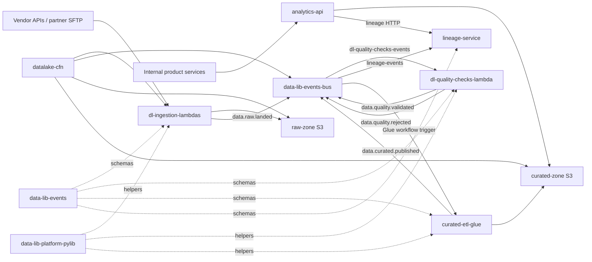

# Dependency map

Cross-repo dependencies - who produces what, who consumes what.

Related: [repo-catalog](repo-catalog.md), [event-contracts](standards/event-contracts.md)

## How to use this page

- Before changing an event, API, or shared library, check who depends on it.
- Before deprecating a service, check who depends on it.
- Claude reads this page when asked "what else might be affected by this change?"

**This page identifies the candidate set - it does not answer whether a specific change breaks a specific consumer.**

For that second step: read each consumer's local `CLAUDE.md` - `Dependencies and usage` section. That section records which fields, methods, and classes the consumer actually relies on. A consumer that imports `data-lib-events` but only reads `batchId` is unaffected by a change to `auditMetadata`.

## Event edges

| Event | Producer | Consumers |
|---|---|---|
| `data.raw.landed` | [dl-ingestion-lambdas](repos/dl-ingestion-lambdas.md) | [dl-quality-checks-lambda](repos/dl-quality-checks-lambda.md), [lineage-service](repos/lineage-service.md) |
| `data.quality.validated` | [dl-quality-checks-lambda](repos/dl-quality-checks-lambda.md) | [curated-etl-glue](repos/curated-etl-glue.md), [lineage-service](repos/lineage-service.md) |
| `data.quality.rejected` | [dl-quality-checks-lambda](repos/dl-quality-checks-lambda.md) | [lineage-service](repos/lineage-service.md) |
| `data.curated.published` | [curated-etl-glue](repos/curated-etl-glue.md) | [lineage-service](repos/lineage-service.md) |

## HTTP APIs

| API | Provider | Consumers |
|---|---|---|
| `GET /lineage/record/{id}` | [lineage-service](repos/lineage-service.md) | [analytics-api](repos/analytics-api.md) |
| `GET /lineage/batch/{id}/downstream` | [lineage-service](repos/lineage-service.md) | [analytics-api](repos/analytics-api.md), BI tools |
| `POST /datasets/{name}/query` | [analytics-api](repos/analytics-api.md) | Internal product services, analyst tooling |

## Shared libraries

- [data-lib-platform-pylib](repos/data-lib-platform-pylib.md) -> consumed by [dl-ingestion-lambdas](repos/dl-ingestion-lambdas.md), [dl-quality-checks-lambda](repos/dl-quality-checks-lambda.md), [curated-etl-glue](repos/curated-etl-glue.md)
- [data-lib-events](repos/data-lib-events.md) -> consumed by event producers and consumers: [dl-ingestion-lambdas](repos/dl-ingestion-lambdas.md), [dl-quality-checks-lambda](repos/dl-quality-checks-lambda.md), [curated-etl-glue](repos/curated-etl-glue.md), [lineage-service](repos/lineage-service.md)

## Queue and trigger edges

| Resource | Producer / Trigger | Consumer |
|---|---|---|
| EventBridge schedules | [datalake-cfn](repos/datalake-cfn.md) | [dl-ingestion-lambdas](repos/dl-ingestion-lambdas.md) |
| Webhook API Gateway routes | [datalake-cfn](repos/datalake-cfn.md) | [dl-ingestion-lambdas](repos/dl-ingestion-lambdas.md) |
| `dl-quality-checks-events` | EventBridge rule for `data.raw.landed` | [dl-quality-checks-lambda](repos/dl-quality-checks-lambda.md) |
| `lineage-events` | EventBridge rules for data lifecycle events | [lineage-service](repos/lineage-service.md) |
| Glue workflow trigger | EventBridge rule for `data.quality.validated` | [curated-etl-glue](repos/curated-etl-glue.md) |

## Infrastructure imports

CloudFormation exports from [datalake-cfn](repos/datalake-cfn.md) are consumed by:

- [dl-ingestion-lambdas](repos/dl-ingestion-lambdas.md)
- [dl-quality-checks-lambda](repos/dl-quality-checks-lambda.md)
- [curated-etl-glue](repos/curated-etl-glue.md)
- [lineage-service](repos/lineage-service.md)
- [analytics-api](repos/analytics-api.md)

A breaking change to a `datalake-cfn` export affects every consumer stack - see [cloudformation](standards/cloudformation.md) for the deprecation-then-removal pattern.

## Diagram

## Discovery

When Claude or an engineer finds an undocumented dependency:

1. Note it in `staging/` with file/line evidence.
2. Add the edge to this page in the appropriate section.
3. Update the two repo pages on each end.
