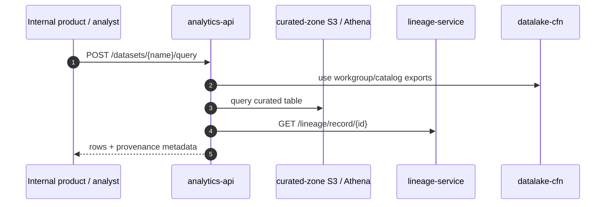

# Dataset query flow

## Summary

Flow for serving curated data and provenance to an internal product or analyst. This is the read path after curation has completed.

## Diagram

## Steps

1. **Request** - an internal product or analyst calls [analytics-api](../repos/analytics-api.md).
2. **Authorize and plan** - analytics-api validates the dataset request and selects the Athena workgroup/catalog exported by [datalake-cfn](../repos/datalake-cfn.md).
3. **Query** - analytics-api reads curated tables written by [curated-etl-glue](../repos/curated-etl-glue.md).
4. **Annotate** - analytics-api calls [lineage-service](../repos/lineage-service.md) to attach provenance.
5. **Return** - the response includes curated rows and lineage metadata.

## Repos involved

- [analytics-api](../repos/analytics-api.md)
- [curated-etl-glue](../repos/curated-etl-glue.md)
- [lineage-service](../repos/lineage-service.md)
- [datalake-cfn](../repos/datalake-cfn.md)

## Failure modes

| Symptom                               | Likely stage                                 | Where to look                             | Runbook                                                             |
| ------------------------------------- | -------------------------------------------- | ----------------------------------------- | ------------------------------------------------------------------- |
| Query fails in one environment        | Infra/catalog drift                          | datalake-cfn exports and Athena workgroup | Escalate prod rollback                                              |
| Query succeeds but provenance missing | Lineage API or event gap                     | lineage-service logs and queue lag        | [sqs-backlog-debugging](../runbooks/sqs-backlog-debugging.md)       |
| New curated column missing            | Curation not deployed or catalog not updated | curated-etl-glue job and Glue Catalog     | [lambda-failure-debugging](../runbooks/lambda-failure-debugging.md) |

## Related docs

- [raw-to-curated-flow](raw-to-curated-flow.md)
- [analytics-api](../repos/analytics-api.md)
- [aws-testing](../standards/aws-testing.md)
