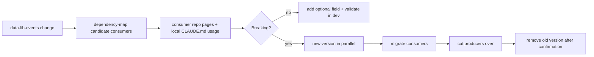

# Event schema rollout flow

## Summary

Flow for changing an event schema in [data-lib-events](../repos/data-lib-events.md). This is the compatibility-first path for shared event changes.

## Diagram

## Steps

1. **Classify the change** - use [event-contracts](../standards/event-contracts.md) to decide whether the schema change is additive or breaking.
2. **Find candidates** - use [dependency-map](../dependency-map.md) to identify producers and consumers.
3. **Confirm exact usage** - read each candidate consumer's local `CLAUDE.md` `Dependencies and usage` section when available.
4. **Change the schema** - update [data-lib-events](../repos/data-lib-events.md) with backwards compatibility unless a versioned rollout is required.
5. **Validate consumers** - dry-run at least one Python consumer and one Java consumer in `dev`.
6. **Update memory** - if a missing consumer or undocumented field usage is discovered, add a staging note before curating central docs.

## Repos involved

- [data-lib-events](../repos/data-lib-events.md)
- [dl-ingestion-lambdas](../repos/dl-ingestion-lambdas.md)
- [dl-quality-checks-lambda](../repos/dl-quality-checks-lambda.md)
- [curated-etl-glue](../repos/curated-etl-glue.md)
- [lineage-service](../repos/lineage-service.md)

## Failure modes

| Symptom | Likely cause | Where to look | Runbook |
|---|---|---|---|
| Consumer deserialization fails | Breaking field/type change shipped as additive | consumer local `CLAUDE.md`, [event-contracts](../standards/event-contracts.md) | [lambda-failure-debugging](../runbooks/lambda-failure-debugging.md) |
| Unknown consumer breaks | Missing edge in dependency map | [dependency-map](../dependency-map.md), staging repo findings | [sqs-backlog-debugging](../runbooks/sqs-backlog-debugging.md) |

## Related docs

- [dependency-map](../dependency-map.md)
- [event-contracts](../standards/event-contracts.md)
- [data-lib-events](../repos/data-lib-events.md)
