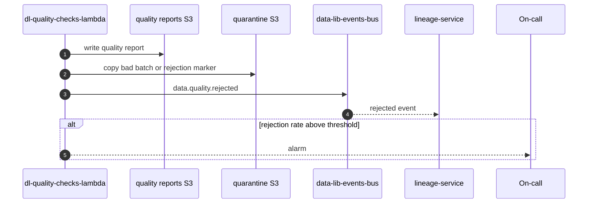

# Quality rejection flow

## Summary

Flow for what happens when a raw batch fails quality checks. This separates expected vendor/data issues from runtime failures.

## Diagram

## Steps

1. **Detect** - [dl-quality-checks-lambda](../repos/dl-quality-checks-lambda.md) runs checks and marks the batch rejected.
2. **Record** - it writes the quality report and quarantine marker to S3.
3. **Publish** - it publishes `data.quality.rejected` using schemas from [data-lib-events](../repos/data-lib-events.md).
4. **Track** - [lineage-service](../repos/lineage-service.md) records the rejection so downstream users can see why the batch stopped.
5. **Respond** - on-call reviews the report, vendor status, and recent ingestion changes before replaying anything.

## Repos involved

- [dl-quality-checks-lambda](../repos/dl-quality-checks-lambda.md)
- [data-lib-events](../repos/data-lib-events.md)
- [data-lib-platform-pylib](../repos/data-lib-platform-pylib.md)
- [lineage-service](../repos/lineage-service.md)

## Failure modes

| Symptom | Likely cause | Where to look | Runbook |
|---|---|---|---|
| Rejections spike for one dataset | Vendor schema or data-quality drift | Quality report and vendor sample | [sqs-backlog-debugging](../runbooks/sqs-backlog-debugging.md) |
| Rejections spike for every dataset | Shared quality runner or schema library issue | [data-lib-platform-pylib](../repos/data-lib-platform-pylib.md), [data-lib-events](../repos/data-lib-events.md) | [lambda-failure-debugging](../runbooks/lambda-failure-debugging.md) |
| Rejected event not visible in lineage | Event delivery or lineage consumer failure | lineage SQS/DLQ | [sqs-backlog-debugging](../runbooks/sqs-backlog-debugging.md) |

## Related docs

- [raw-to-curated-flow](raw-to-curated-flow.md)
- [dl-quality-checks-lambda](../repos/dl-quality-checks-lambda.md)
- [event-contracts](../standards/event-contracts.md)
