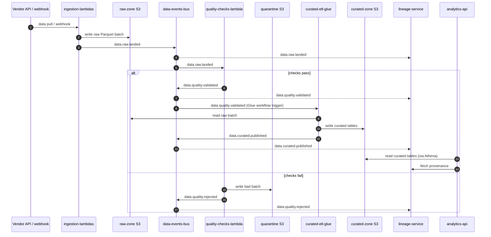

# Raw → curated flow

## Summary

End-to-end flow from an external source landing a raw batch to curated data being available for [[analytics-api]]. This is the happy path; failure modes are at the bottom.

## Diagram

## Steps

1. **Ingest** — [[ingestion-lambdas]] pulls from the vendor (schedule or webhook) and writes the raw Parquet batch to the raw zone S3 bucket, then emits `data.raw.landed` on the `data-events-bus`.
2. **Fan-out** — [[lineage-service]] records the event. [[quality-checks-lambda]] receives it via its SQS subscription.
3. **Quality check** — [[quality-checks-lambda]] runs the declarative check suite for the (source, dataset) pair.
   - Pass → emits `data.quality.validated`.
   - Fail → writes to quarantine, emits `data.quality.rejected`, the on-call gets paged if the rejection rate is above threshold.
4. **Curate** — A Glue workflow trigger listening for `data.quality.validated` starts the right job in [[curated-etl-glue]]. The job reads the raw batch, applies the curation logic, writes curated Parquet, and emits `data.curated.published`.
5. **Lineage** — [[lineage-service]] has now observed the full chain and can answer provenance queries.
6. **Serve** — [[analytics-api]] serves curated data on demand (Athena-backed) and calls the lineage API to annotate responses.

## Repos involved

- [[ingestion-lambdas]]
- [[quality-checks-lambda]]
- [[curated-etl-glue]]
- [[lineage-service]]
- [[analytics-api]]
- Infra: [[datalake-cfn]]

## Events and APIs

- `data.raw.landed`
- `data.quality.validated`
- `data.quality.rejected`
- `data.curated.published`
- `GET /lineage/record/{id}` ([[lineage-service]])
- `POST /datasets/{name}/query` ([[analytics-api]])

## Failure modes

| Symptom | Likely stage | Where to look | Runbook |
|---|---|---|---|
| Raw batch never appears in S3 | Ingest | CloudWatch logs for `ingest-*`; vendor API status | [[lambda-failure-debugging]] |
| `quality-checks-events` queue backing up | Quality check | [[quality-checks-lambda]] Lambda metrics | [[sqs-backlog-debugging]] |
| Rejection rate spike | Quality check | Quality report in S3; vendor-side data change | [[sqs-backlog-debugging]] + [[quality-checks-lambda]] "Known gotchas" |
| Glue job fails | Curate | Glue console + `/aws-glue/jobs/error` | [[lambda-failure-debugging]] (playbook applies) + [[curated-etl-glue]] "Known gotchas" |
| Curated rows present but lineage incomplete | Lineage | [[lineage-service]] SQS lag + DLQ | [[sqs-backlog-debugging]] |
| Analytics API 5xx spike | Serve | [[analytics-api]] logs + Athena workgroup | [[analytics-api]] "Known gotchas" |
| Curated query works in `dev` but fails in `prod` | Infra | CloudFormation drift on [[datalake-cfn]] exports | [[cloudformation-rollback]] |

## Related docs

- Standards: [[event-contracts]], [[aws-testing]], [[observability]]
- Runbooks: [[lambda-failure-debugging]], [[sqs-backlog-debugging]], [[cloudformation-rollback]]
- Concepts: [[idempotency]]
