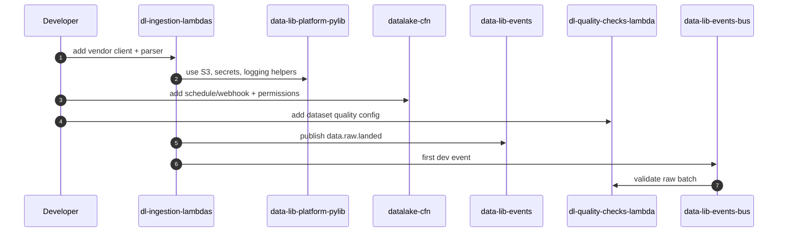

# Vendor onboarding flow

## Summary

Flow for adding a new upstream vendor or dataset to the data lake. This is the path from vendor contract to first validated raw batch in `dev`.

## Diagram

## Steps

1. **Source integration** - [dl-ingestion-lambdas](../repos/dl-ingestion-lambdas.md) adds the vendor client, pagination/auth handling, and raw file writer.
2. **Shared helpers** - ingestion uses [data-lib-platform-pylib](../repos/data-lib-platform-pylib.md) for secrets, S3 writes, retries, and correlation IDs.
3. **Infrastructure** - [datalake-cfn](../repos/datalake-cfn.md) adds the schedule or webhook route, IAM permissions, and any source-specific secrets wiring.
4. **Quality config** - [dl-quality-checks-lambda](../repos/dl-quality-checks-lambda.md) adds the dataset check suite before the source is enabled outside `dev`.
5. **Event contract** - [data-lib-events](../repos/data-lib-events.md) remains unchanged unless the vendor requires a new raw landed event field.
6. **First validation** - trigger one ingest in `dev`, confirm `data.raw.landed` and the expected quality outcome.

## Repos involved

- [dl-ingestion-lambdas](../repos/dl-ingestion-lambdas.md)
- [dl-quality-checks-lambda](../repos/dl-quality-checks-lambda.md)
- [data-lib-platform-pylib](../repos/data-lib-platform-pylib.md)
- [data-lib-events](../repos/data-lib-events.md)
- [datalake-cfn](../repos/datalake-cfn.md)

## Failure modes

| Symptom | Likely stage | Where to look | Runbook |
|---|---|---|---|
| Vendor returns success with unusable payload | Source integration | Vendor client parser and raw sample fixtures | [lambda-failure-debugging](../runbooks/lambda-failure-debugging.md) |
| Raw file lands but no event appears | Event publish | EventBridge permissions and `data-lib-platform-pylib` event publisher | [lambda-failure-debugging](../runbooks/lambda-failure-debugging.md) |
| Quality rejects every batch | Quality config | Dataset check suite and vendor schema sample | [sqs-backlog-debugging](../runbooks/sqs-backlog-debugging.md) |

## Related docs

- [raw-to-curated-flow](raw-to-curated-flow.md)
- [event-contracts](../standards/event-contracts.md)
- [aws-testing](../standards/aws-testing.md)
