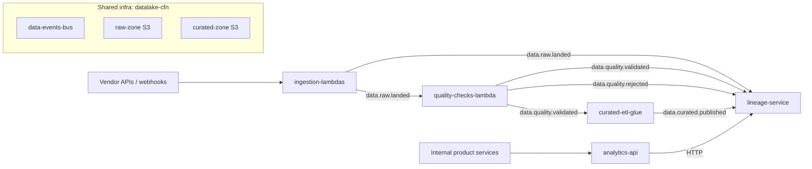

# Dependency map

Cross-repo dependencies - who produces what, who consumes what.

Related: [[repo-catalog]], [[shared-libraries]], [[event-contracts]]

## How to use this page

- Before changing an event, API, or shared library, check who depends on it.
- Before deprecating a service, check who depends on it.
- Claude reads this page when asked "what else might be affected by this change?"

**This page identifies the candidate set - it does not answer whether a specific change breaks a specific consumer.**

For that second step: read each consumer's local `CLAUDE.md` - `Dependencies and usage` section. That section records which fields, methods, and classes the consumer actually relies on. A consumer that imports `data-events` but only reads `batchId` is unaffected by a change to `auditMetadata`.

A collected view of consumer usage is also available in [[usage-summaries]].

## Events

| Event | Producer | Consumers |
|---|---|---|
| `data.raw.landed` | [[ingestion-lambdas]] | [[quality-checks-lambda]], [[lineage-service]] |
| `data.quality.validated` | [[quality-checks-lambda]] | [[curated-etl-glue]], [[lineage-service]] |
| `data.quality.rejected` | [[quality-checks-lambda]] | [[lineage-service]] |
| `data.curated.published` | [[curated-etl-glue]] | [[lineage-service]] |

## HTTP APIs

| API | Provider | Consumers |
|---|---|---|
| `GET /lineage/record/{id}` | [[lineage-service]] | [[analytics-api]] |
| `GET /lineage/batch/{id}/downstream` | [[lineage-service]] | [[analytics-api]], BI tools |
| `POST /datasets/{name}/query` | [[analytics-api]] | Internal product services, analyst tooling |

## Shared libraries

See [[shared-libraries]] for the canonical list. Summary:

- [[data-platform-pylib]] -> consumed by [[ingestion-lambdas]], [[quality-checks-lambda]], [[curated-etl-glue]]
- [[data-events]] -> consumed by every event producer and consumer

## Infrastructure imports

CloudFormation exports from [[datalake-cfn]] are consumed by:

- [[ingestion-lambdas]]
- [[quality-checks-lambda]]
- [[curated-etl-glue]]
- [[lineage-service]]
- [[analytics-api]]

A breaking change to a `datalake-cfn` export affects every consumer stack - see [[cloudformation]] for the deprecation-then-removal pattern.

## Diagram

## Discovery

When Claude or an engineer finds an undocumented dependency:

1. Note it in `staging/repo-findings/` with file/line evidence.
2. Add the edge to this page in the appropriate section.
3. Update the two repo pages on each end with a wikilink.
